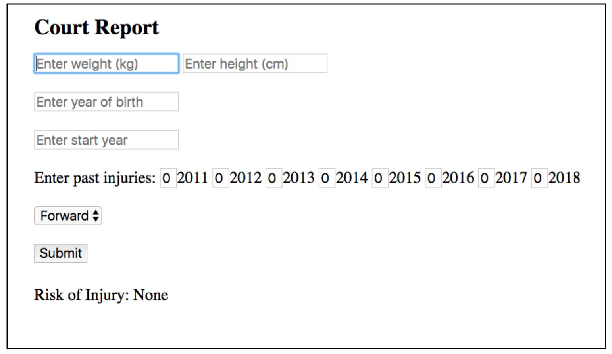

# Predicting NBA Knee Injuries 
At Insight, I built a simple web app for predicting knee injuries in NBA which can be found online at: https://court-report.herokuapp.com/

## Use Case 
Injuries significantly lower a team's odds of success. Assume you are an NBA team manager and you have a tool that predicts the risk of injury of your players. Now, you can prepare for worst case scenarios by training backups for players at high risk of injury. You also have the option to not to hire a player who is at high risk of injury. 

Such a tool does not exist. At least it is not publicly available. I decided to make an attaempt at building such a tool. The figure below shows the first iteration of this ML based product:

This product is focused on knee injuries only as they are the injuries that happen with the highest frequency. For example, consider a player who weighs 100 Kg, his height is 200 cm, is born in 1990, started his career in 2015, playes the guard position and experinced one knee injury in 2016. The risk of another knee injury in 2020 for this player is 17%. One way to make sense out of this number is to run it for all of the players, then rank the players from highest to lowest risk and prioretize attention to the players with the highest risk of injury. 

At Insight, I decided to take a shot at predicting knee injuries in NBA. I collected data including injury reports on all the players who played in NBA between 2010 and 2018 by scrapping NBA databases. I spent a lot of time understanding, cleaning, analyzing the data and engineering features. I built a web app that inputs a player's weight, height, age, position, number of years played and the history of the past knee injuries from year N-8 to year N-1 and outputs the risk of the knee injury in year N. The app's predictions are 2.5x more accurate than random guess. This reposetory includes all the files I created to build the web app on Heroku using Flask as the final deliverable of my Insight project.

The web app can be found at: https://court-report.herokuapp.com/

The code is presented in the following jupyter notebook: NBA_injuries_prediction.ipynb 

FinalDemo.pdf is the pdf version of the project demo.  

